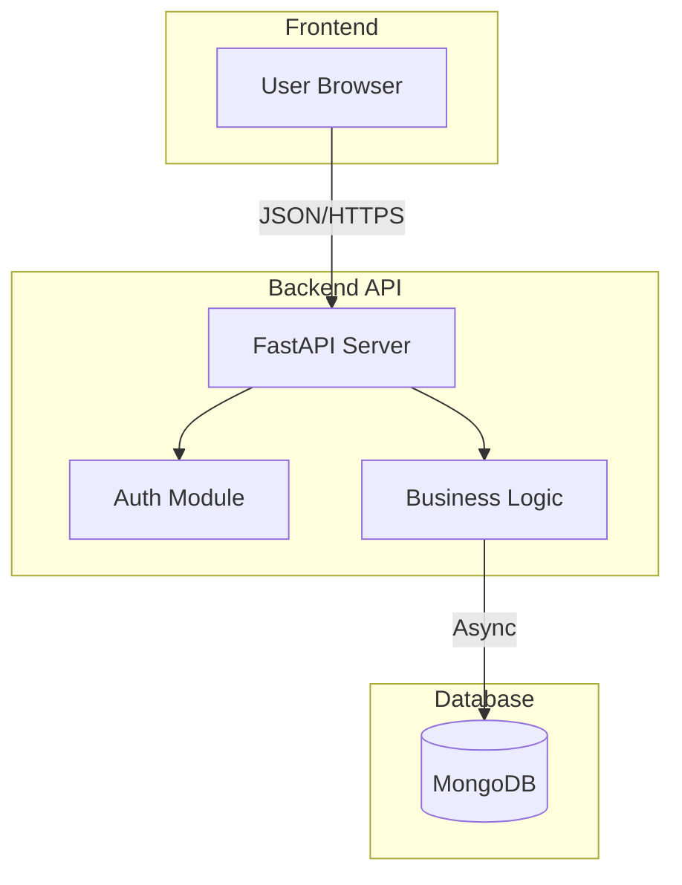

# SilaiBook Technical Overview

**Version:** 1.0
**Date:** 2026-02-06
**Project:** SilaiBook - Digital Munshi for Tailoring Shops

---

## 1. Executive Summary
SilaiBook is a comprehensive shop management solution designed specifically for tailoring businesses. It replaces traditional paper registers ("Munshi") with a modern, digital dashboard. Key capabilities include:
- **Order Tracking:** Kanban and list views for tracking orders from "Received" to "Delivered".
- **Customer CRM:** Storage of measurements and order history for every client.
- **Inventory Management:** Tracking of fabric/cloth stock and usage.
- **Financials:** Management of payments, expenses, and profit/loss tracking.

---

## 2. System Architecture

The system follows a modern 3-tier architecture:

### Frontend (Client Layer)
- **Framework:** React 19 + Vite 7.2
- **Styling:** Tailwind CSS 4.1 for responsive design.
- **State Management:** React Context API & Hooks.
- **Visualization:** Recharts for financial analytics.
- **Hosting:** Single Page Application (SPA).

### Backend (API Layer)
- **Framework:** FastAPI (Python 3.10+)
- **Architecture:** RESTful API with Pydantic for data validation.
- **Authentication:** OAuth2 with JWT (JSON Web Tokens).
- **Security:** BCrypt password hashing, CORS middleware.

### Database (Data Layer)
- **Primary Store:** MongoDB (accessed via Motor/Beanie ODM).
- **Data Models:** Documents for `Orders`, `Customers`, `ClothStock`, and `Payments`.

---

## 3. Key Workflows

### 3.1 Order Creation Process
The order creation process is the core operational workflow.
1.  **Input:** Staff enters customer details and measurements in the `NewOrderModal`.
2.  **Validation:** Frontend validates form data.
3.  **Submission:** Data is sent to `POST /orders/`.
4.  **Stock Check:** Backend checks MongoDB for sufficient `ClothStock`.
    - If insufficient, a 400 Error is returned.
    - If sufficient, stock is deducted (`$inc: {used_meters: -X}`) and usage is logged.
5.  **Confirmation:** An Order ID (e.g., `ORD-2024-0042`) is generated and returned.

### 3.2 Order Status Lifecycle
Orders move through a predefined set of states to track production progress:
1.  **Received:** Order created, cloth assigned.
2.  **Cutting:** Master is cutting the fabric.
3.  **Stitching:** Tailor is assembling the garment.
4.  **Finishing:** Hemming, ironing, and quality check.
5.  **Ready:** Garment is packed. (Triggers final timestamps).
6.  **Delivered:** Customer pickup and final payment.

---

## 4. Data Models

### Customers
Stores personal info and measurement data.
- `name`: String
- `mobile`: String (Unique identifier)
- `measurements`: Object (e.g., `{ chest: 40, waist: 34 }`)

### Orders
The central entity linking customers and production.
- `order_number`: String (Unique)
- `status`: Enum (Received, Cutting, Stitching, Ready, Delivered)
- `price`: Float
- `delivery_date`: DateTime

### Cloth Stock
Inventory tracking for fabrics.
- `cloth_type`: String (e.g., "Linen", "Cotton")
- `total_meters`: Float
- `used_meters`: Float
- `remaining_meters`: Float (Computed)

---

## 5. Technology Stack Summary

| Layer | Technology |
|-------|------------|
| **Frontend** | React, Vite, TailwindCSS, Framer Motion |
| **Backend** | Python, FastAPI, Uvicorn |
| **Database** | MongoDB, Beanie ODM |
| **DevOps** | Git, Virtual Environment (venv) |

---

## 6. Access Control
Access to the system is secured via JWT.
1.  User posts credentials to `/auth/token`.
2.  Server returns a `access_token`.
3.  Frontend attaches `Authorization: Bearer <token>` to all subsequent requests.
4.  Backend validates the signature before processing requests.
