# CORPWISE - Visual Project Workflow

This document provides comprehensive visual diagrams showcasing how the CORPWISE enterprise knowledge assistant works end-to-end.

---

## 🏗️ System Architecture Overview

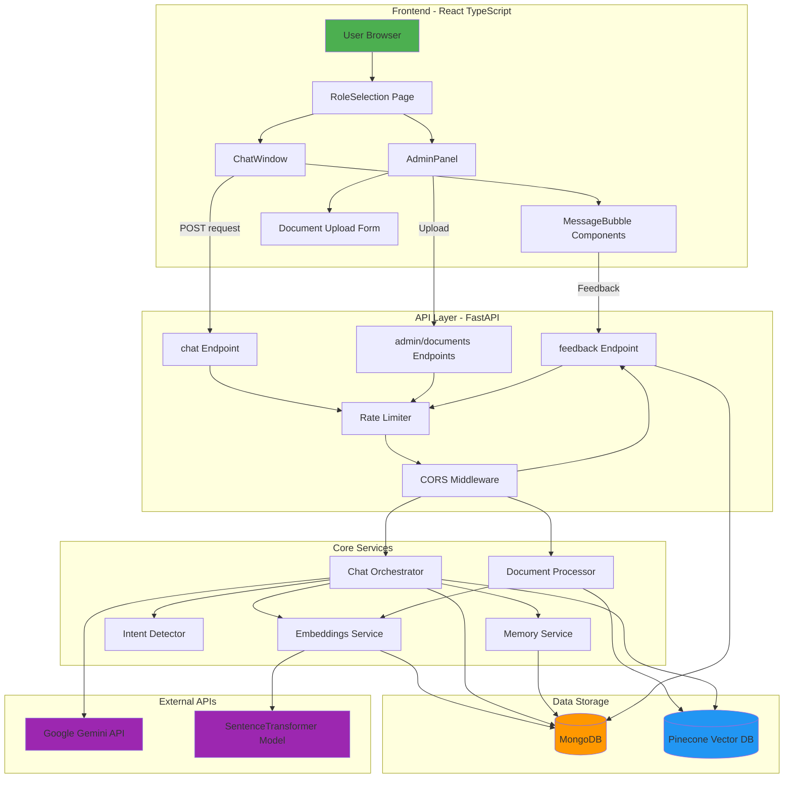

---

## 💬 User Chat Flow - Detailed

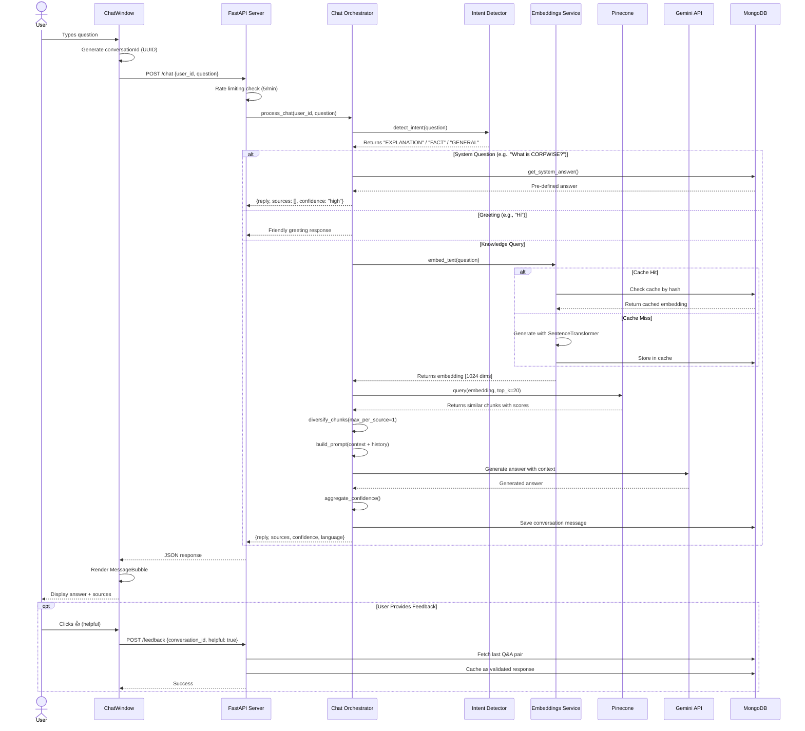

---

## 📤 Admin Document Upload Flow

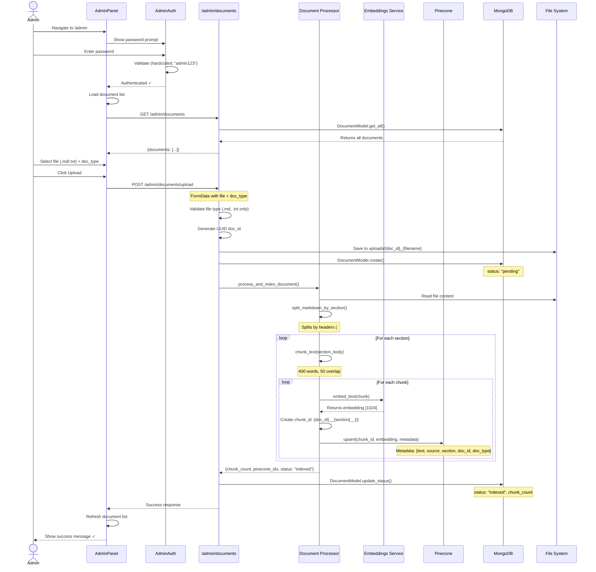

---

## 🔍 RAG (Retrieval Augmented Generation) Pipeline

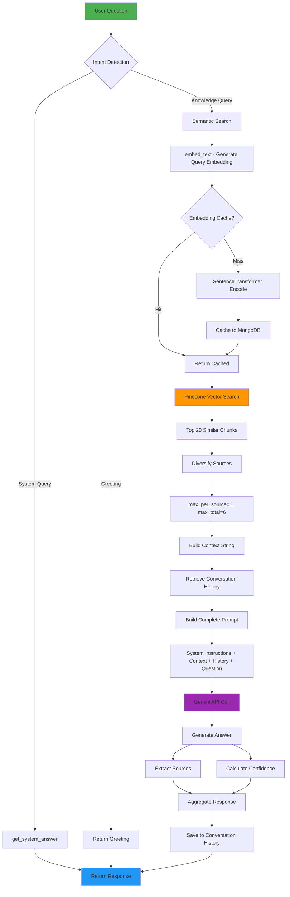

---

## 🗄️ Data Models & Storage

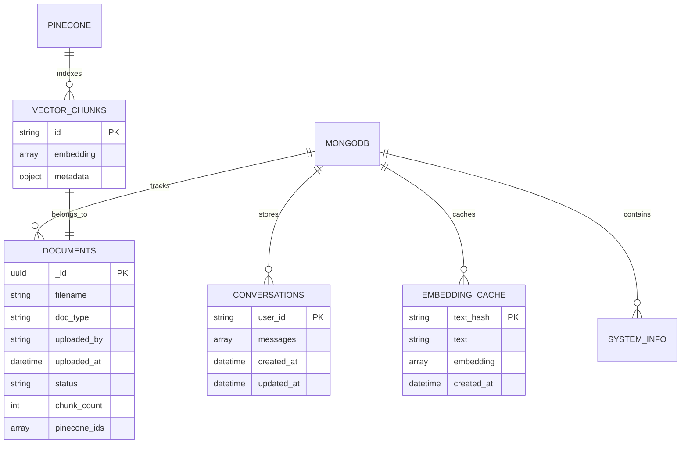

---

## 🎯 Component Interaction Map

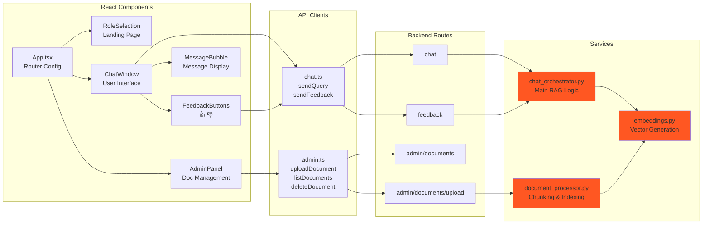

---

## ⚡ Request/Response Flow Examples

### Example 1: "Who is the CEO of CORPWISE?"

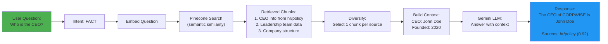

### Example 2: Document Upload

```mermaid
graph LR
    A["Admin uploads:<br/>employee_handbook.md"] --> B[Validate .md format]
    B --> C["Generate UUID:<br/>abc-123-def"]
    C --> D["Save to disk:<br/>uploads/abc-123-def_employee_handbook.md"]
    D --> E[Split by sections:<br/># Benefits<br/># Leave Policy<br/># Code of Conduct]
    E --> F[Chunk each section:<br/>400 words, 50 overlap]
    F --> G["Generate embeddings:<br/>25 chunks total"]
    G --> H["Store in Pinecone:<br/>with metadata"]
    H --> I["Update MongoDB:<br/>status: indexed<br/>chunk_count: 25"]
    I --> J["✓ Available for<br/>retrieval in chat"]
    
    style A fill:#FF9800
    style J fill:#4CAF50
```

---

## 🔄 Caching Strategy

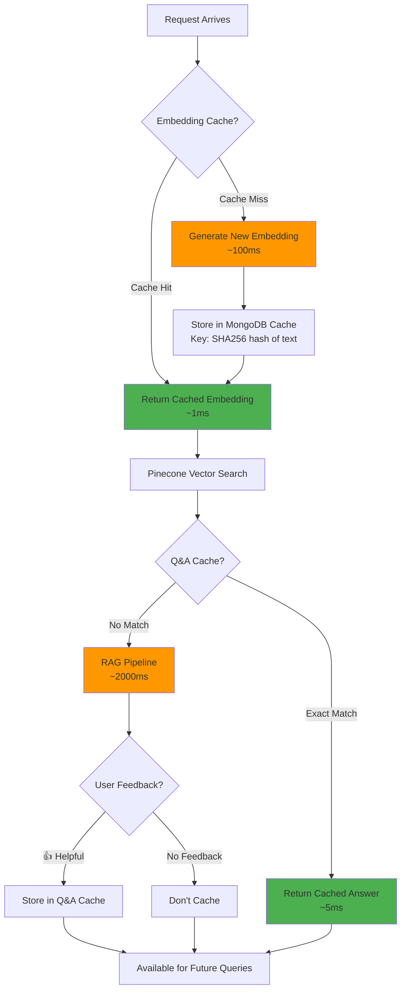

---

## 📊 Technology Stack Visualization

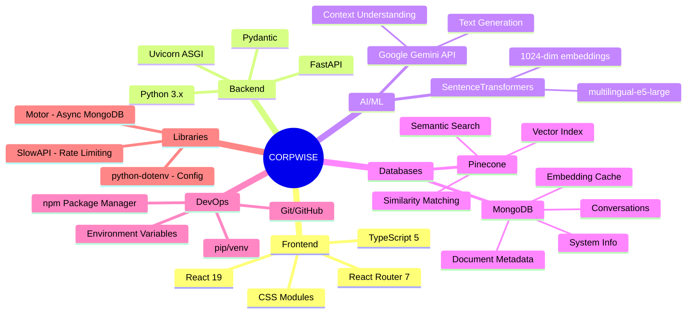

---

## 🎨 User Journey Map

### User Journey: Getting an Answer

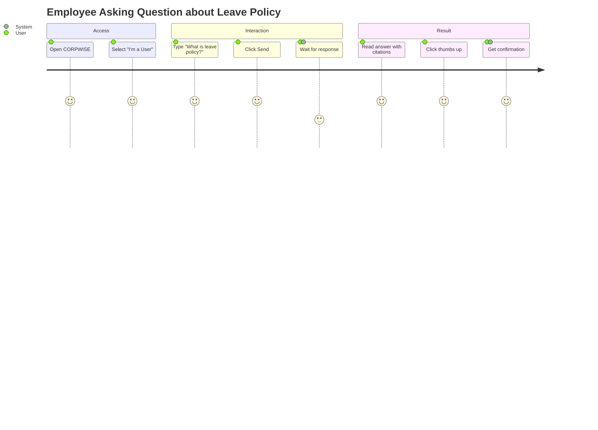

### Admin Journey: Adding Documentation

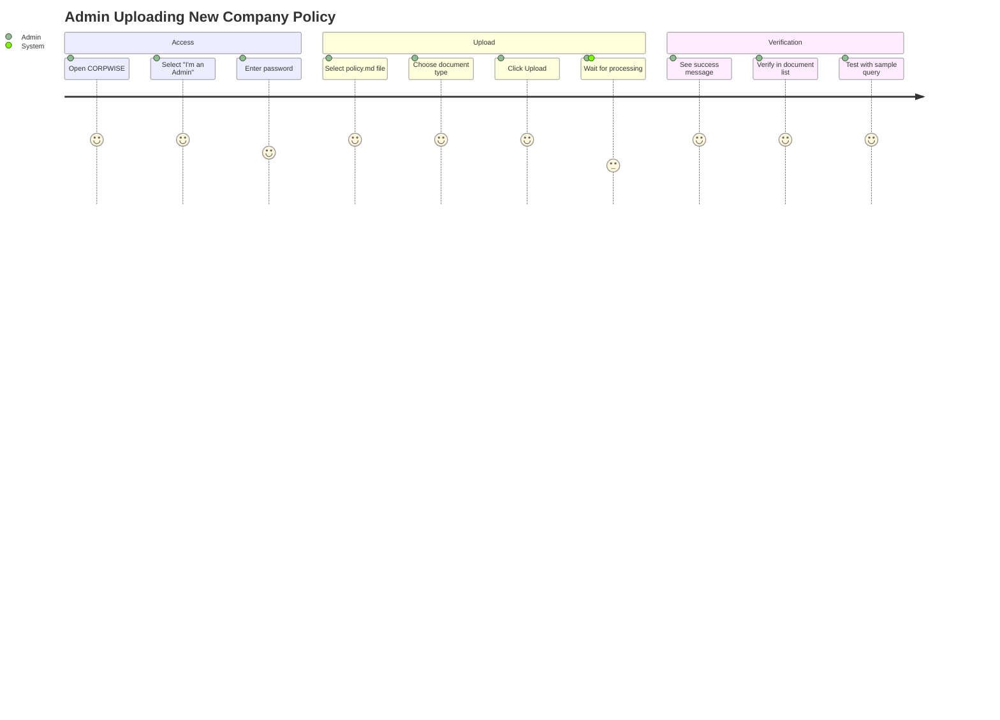

---

## 🚀 Deployment Architecture

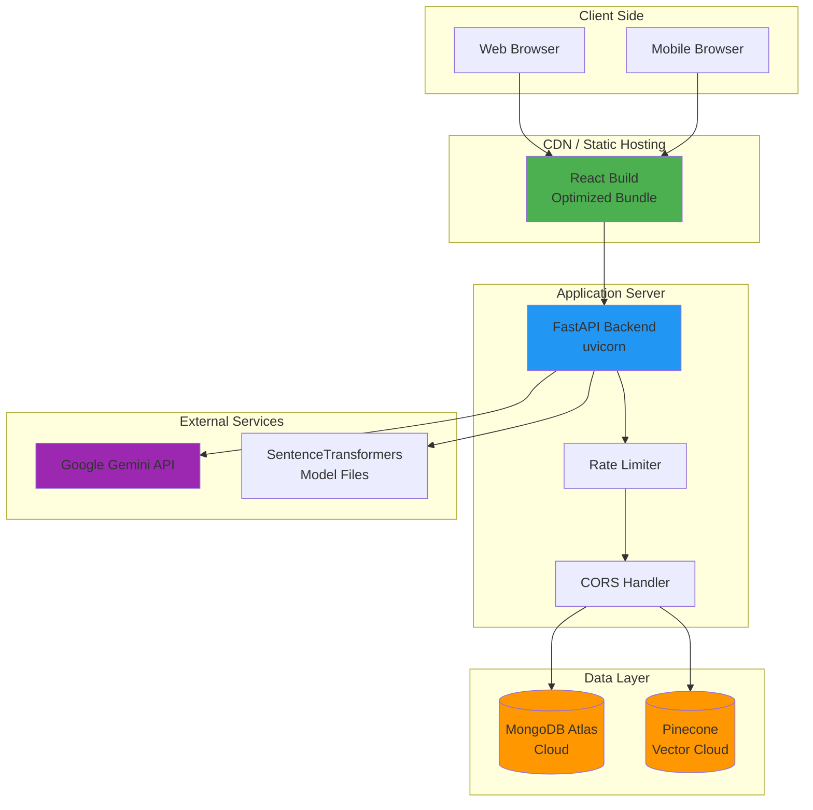

---

## 📈 Performance Metrics Flow

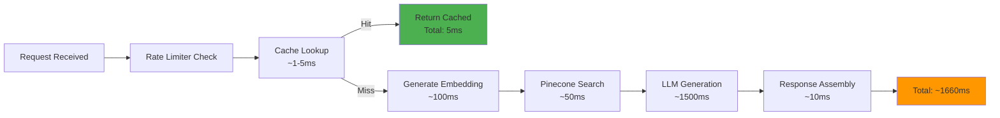

---

## 🔐 Security & Authentication Flow

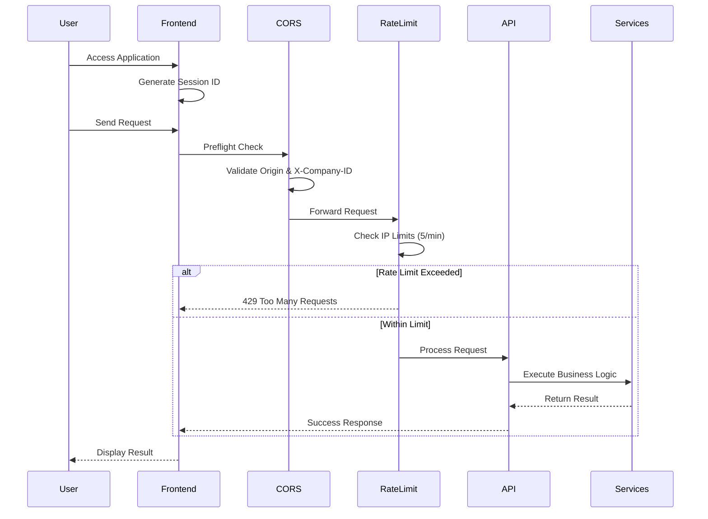

---

---

## 🏢 Multi-Tenant Data Isolation

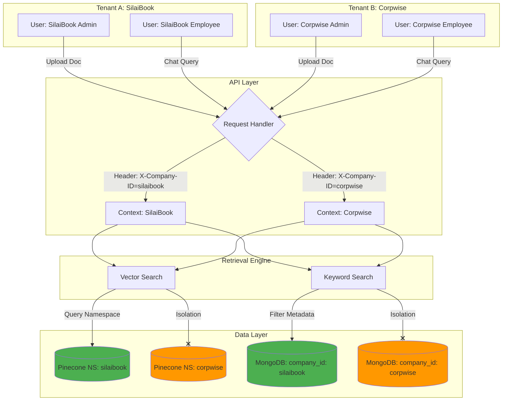

---

## 🌗 Dual-Mode Frontend Architecture

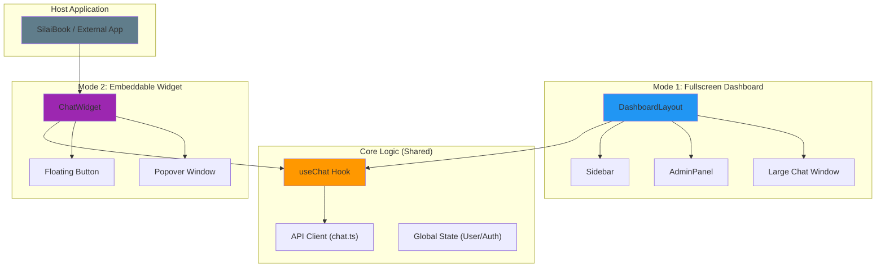
